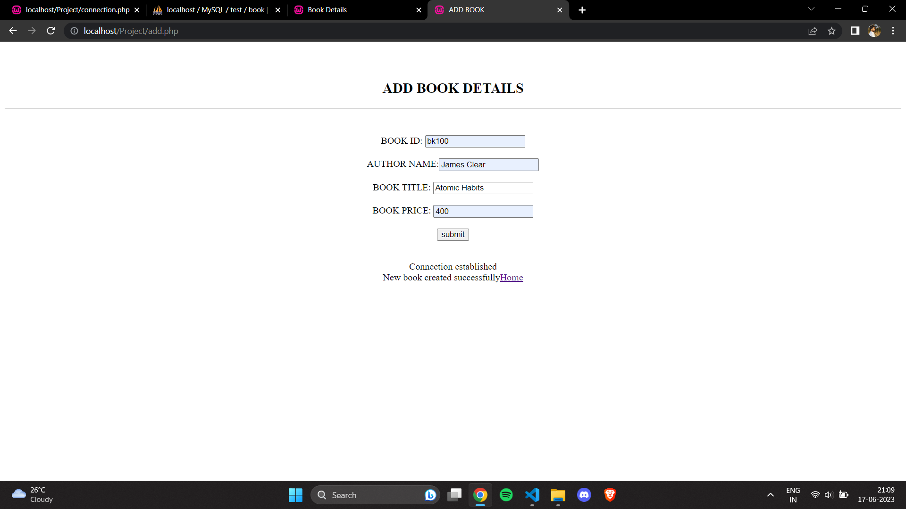

# Book-Application
A basic Book Management Application using PHP that performs CRUD operations.
 
 
The database contains bookid,author,title and price.
 
I used the wamp server for the operations.
 
<h3>Screenshots of the Results :</h3>
 
 

 
 

 

 
 

 
 

 
 

 

 
 

 
 